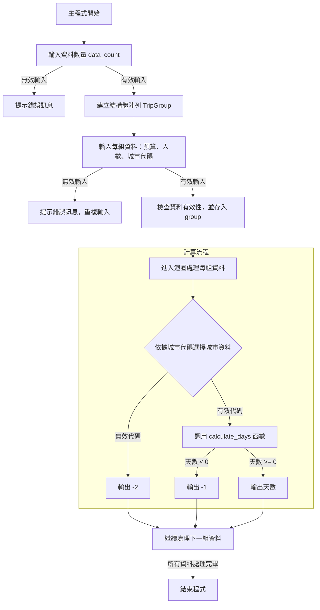

# Homework 1: 出國天數計算機  
**4112052024 生科二 楊捷壬**

## 簡介及設計思維 

這次作業的目的是撰寫一個程式，用來計算在不同城市旅遊時，依據預算、旅客人數、機票價格、匯率及每日花費，能夠旅遊的天數。  

這次程式我原本是想以字元陣列作為主要資料結構做編寫，但編寫途中發現，在 C 語言中，字元陣列（char array）需要先宣告容器大小，因為 C 語言無法動態調整陣列的大小，可以動態調整字元陣列的方法只能透過動態記憶體，其中指標這個概念再我多次閱讀之後還不是很理解，因此改用 **Struct 結構體** 作為主要的資料結構

## 流程圖

以下是程式執行流程的簡化示意圖：


## 程式概述
### 功能描述
- User輸入多組資料，每組資料包含：
  - 預算 (`budget`)
  - 人數 (`num_people`)
  - 城市代號 (`capital`)
- 根據所選擇的城市，計算可以旅遊的天數。

### 資料結構及變數說明
1. `TripGroup`: 儲存使用者輸入每組旅遊資訊的結構
    - `budget`: 旅遊預算（`int`）
    - `num_people`: 旅遊人數（`int`）
    - `capital`: 目的地城市代碼（`int`）

2. `TripCost`: 儲存每個城市的費用資訊的結構
    - `flight_price`: 機票價格（`int`）
    - `exchange_rate`: 匯率（`float`）
    - `daily_cost`: 每日開銷（`int`）

### `calculate_days` 函數內變數
此處local作為變數名稱命名前綴，一部分是因為 **當地** 一部分是因為 **區域變數（local variables）**
1. `local_budget`: 同時作為當前的旅遊預算以及扣除機票後所剩餘金額（`int`，來自 `TripGroup` 結構）
2. `local_num_people`: 旅遊人數（`int`，來自 `TripGroup` 結構）
3. `flight_price`: 機票價格（`int`，來自 `TripCost` 結構）
4. `exchange_rate`: 匯率，用於換算當地貨幣（`float`，來自 `TripCost` 結構）
5. `daily_cost`: 每日花費（`int`，來自 `TripCost` 結構）
6. `days`: 計算出的可旅遊天數，並回傳（`int`）

### 主程式變數

1. `data_count`: User輸入的資料組數（`int`）
2. `i`: 迴圈計數器，用於遍歷每組資料（`int`）
3. `group`: 儲存每組旅遊資料的結構陣列（`TripGroup[]`）
4. `cost_table`: 結構陣列，包含每個城市的費用資訊（`TripCost[]`）

#### cost_table城市對應表
cost_table 定義了多個城市的費用資訊，對應的索引為城市代號：
- 0: 東京 (Tokyo)
- 1: 首爾 (Seoul)
- 2: 曼谷 (Bangkok)
- 3: 倫敦 (London)
- 4: 巴黎 (Paris)
- 5: 紐約 (New York)
- 6: 雪梨 (Sydney)
- 7: 台北 (Taipei) 

## 程式說明

### calculate_days函式說明  

#### 傳入參數
- local_budget：User輸入該組總預算。
- local_num_people：User輸入該組旅行人數。
- flight_price：每張機票的價格。
- exchange_rate：匯率。
- daily_cost：每人每日的花費。

```c
int calculate_days(int local_budget, int local_num_people, int flight_price, float exchange_rate, int daily_cost) {
    if (local_budget - (local_num_people*flight_price) <= 0) {
        return -1; //若預算不夠支付所有人的機票，回傳 -1
    }
    local_budget = local_budget - (local_num_people*flight_price); //扣掉機票
    local_budget *= exchange_rate; //乘以匯率
    int days = local_budget/(daily_cost*local_num_people); // 除以每日花費
    
    return days < 1 ? 0 : days; //假如days<1天，回傳0，否則回傳days值
}
```
### 主程式說明  
**定義資料結構與費用對照表**
```c
    int data_count, i, days;
    
    struct TripGroup{
        int budget;
        int num_people;
        int capital;
    };
    
    struct TripCost {
        int flight_price;
        float exchange_rate;
        int daily_cost;
    };
    
    const struct TripCost cost_table[] = {
        { 15000, 4, 15000},     // 0: Tokyo
        { 10000, 40, 60000},    // 1: Seoul
        { 12000, 1.1, 2000},    // 2: Bangkok
        { 35000, 0.025, 200},   // 3: London
        { 33000, 0.03, 180},    // 4: Paris
        { 40000, 0.032, 220},   // 5: New York
        { 32000, 0.048, 250},   // 6: Sydney
        { 0, 1, 3000}           // 7: Taipei
    };
```
**讓User輸入資料有幾組，並且檢測是否為正整數**
```c
    printf("請輸入資料數量: ");
    if (scanf("%d", &data_count) != 1 || data_count <= 0) {
         printf("輸入無效，請輸入一個正整數。\n");
         return 1;
    }
    
    struct TripGroup group[data_count];
```
**使用for迴圈，依序輸入進group的資料結構中**  
**如果budget、num_people <= 0，那讓使用者重新輸入**
```c
    printf("請輸入每組資料(預算 人數 城市代碼):\n");
    printf("城市代碼: 0.Tokyo 1.Seoul 2.Bangkok 3.London 4.Paris 5.New York 6.Sydney 7.Taipei\n");
    
    for (i=0; i<data_count; i++) {
        printf("現在輸入的是第 %d 組的資料:", i+1);
        scanf("%d %d %d",
              &group[i].budget,
              &group[i].num_people,
              &group[i].capital);
        if (group[i].budget <= 0 || group[i].num_people <= 0 ) {
            printf("輸入無效，請重新輸入。\n");
            while (getchar() != '\n');  // 清除輸入緩衝區 ChatGPT生成的一行程式
            i--;
        }
    }
```
在此針對清空緩衝區這行指令做解釋    
在C語言使用```scanf()```的時候會先把輸入的資料放到緩衝區，scanf() 進行輸入時，程式會逐一從緩衝區讀取字符。當 getchar() 讀取一個字符後，該字符會從緩衝區中移除，直到讀取到換行符號停止，因此我可以靠```getchar()```逐個讀取字符，來清空緩衝區。
```c
while (getchar() != '\n');
```
使用for迴圈，依序對每組資料做判斷   
使用switch迴圈對```group[i].capital```值做城市的判別
將以下五個值傳入```calculate_days()```函式
```
group[i].budget,
group[i].num_people,
cost_table[group[i].capital].flight_price,
cost_table[group[i].capital].exchange_rate,
cost_table[group[i].capital].daily_cost
```
當回傳的值 = -1時，print("-1")，因為此時預算不夠支付所有人的機票
如果不是就print("計算出來的值")
那如果i < data_count - 1，就代表現在不是最後一個，所以需要print空格把每組數據隔開
```c
    for (i=0; i<data_count; i++) {
        switch (group[i].capital) {
            case 0: //Tokyo
                days = calculate_days(group[i].budget,
                                      group[i].num_people,
                                      cost_table[group[i].capital].flight_price,
                                      cost_table[group[i].capital].exchange_rate,
                                      cost_table[group[i].capital].daily_cost);
                if (days == -1) {
                    printf("-1");
                } else {
                    printf("%d", days);
                }
                
                break;
            case 1: //Seoul
            //重複其他case

            case 2: //Bangkok
            //重複其他case

            case 3: //London
            //重複其他case
            
            case 4: //Paris
            //重複其他case

            case 5: //New York
            //重複其他case

            case 6: //Sydney
            //重複其他case

            case 7: //Taipei
            //重複其他case

            default:
                printf("-2");
                break;
        }
        if (i < data_count - 1) {
            printf(" ");
        }
    }
```
## 網路資源
查詢如何校驗為正整數 https://docs.pingcode.com/baike/1072705    
學習結構體的編寫語法與結構 https://hackmd.io/@metal35x/H1VBKTnQL  
發現scanf()輸入的緩衝區問題 https://www.youtube.com/watch?v=my-0xCJNgoM 

