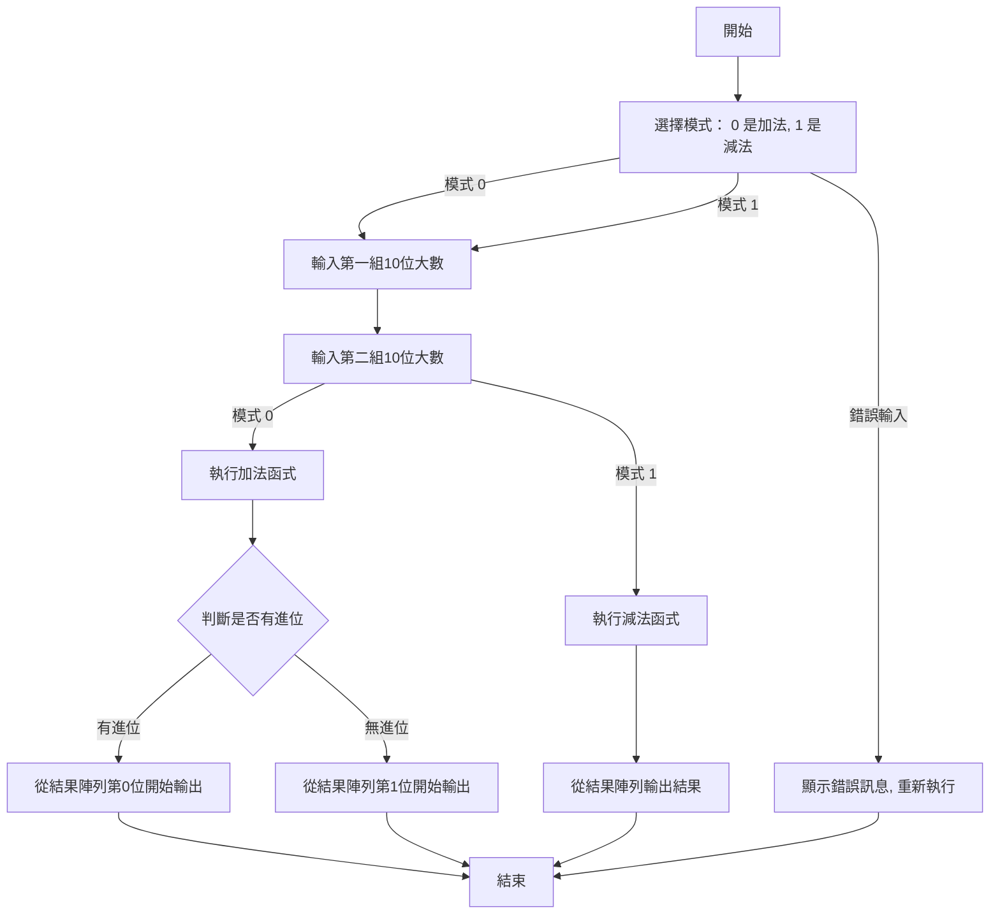

# Homework 2: 大數運算計算機（加減法）
**4112052024 生科二 楊捷壬**

## 簡介及設計思維 

這次作業是透過 **Array 陣列** 作為主要資料結構  
加減法的邏輯使用 **Function 函式** 來簡化主程式結構以及長度

## 流程圖

以下是程式執行流程的簡化示意圖：



## 程式概述
### 功能描述
User輸入三筆資料，資料包含：
- 加減法 
- 第一組大數
- 第二組大數
### 資料結構及變數說明
#### 整數陣列 int[]： 
`num1[10]` 用來儲存第一個10位數   
`num2[10]` 用來儲存第二個10位數    
`result[11]` 用來儲存運算結果  
#### 整數型變數 int：
`carry` 用來儲存加法過程中的進位。
`borrow` 用來儲存減法過程中的借位。  
`sum` 和 `diff`: 在加法和減法中分別用來儲存每一位的暫時運算結果。  
`mode` 用來判斷用戶選擇的運算模式（加法或減法）。  
`i` 作為迴圈變數來控制迴圈。

## 程式說明
### 加法函式 add
```c
void add(int num1[], int num2[], int result[]) {
    int carry = 0;
    for (int i = 9; i >= 0; i--) {
        int sum = num1[i] + num2[i] + carry;
        if (sum >= 10) {
            result[i + 1] = sum - 10;
            carry = 1;
        } else {
            result[i + 1] = sum;
            carry = 0;
        }
    }
    result[0] = carry; // 用於處理進位
}
```
這個函式執行兩個大數的加法。  
從最低位（索引值9）開始逐位相加，並考慮進位`carry`。  
如果相加結果大於或等於10，則減去10並設置進位，否則將結果直接存入 `result[]`。
### 減法函式 sub
```c
void sub(int num1[], int num2[], int result[]) {
    int borrow = 0;
    for (int i = 9; i >= 0; i--) {
        int diff = num1[i] - num2[i] - borrow;
        if (diff < 0) {
            result[i] = diff + 10;
            borrow = 1;
        } else {
            result[i] = diff;
            borrow = 0;
        }
    }
}
```
這個函式用於執行兩個大數的減法  
從最低位開始相減，並考慮是否要進位`borrow`  
如果當前位結果小於0，則加10並借位，否則直接存入`result[]`。
## 主函式 main：
```c
int main(void) {
    int mode, i = 0;
    int num1[10], num2[10], result[11] = {0};
    
    printf("請選擇模式。0 是加法，1 是減法:");
    scanf("%d", &mode);
```
主函式開始，宣告mode、i、num1[]、num2[]、result[]
程式首先請用戶選擇運算模式，0 代表加法，1 代表減法。
### 輸入數字：
```c
printf("請輸入第一組10位大數: ");
for (i = 0; i < 10; i++) {
    scanf("%1d", &num1[i]);  // 輸入第一組大數
}

printf("請輸入第二組10位大數: ");
for (i = 0; i < 10; i++) {
    scanf("%1d", &num2[i]);  // 輸入第二組大數
}
```
輸入兩個10位數的整數，並將其存入 num1[] 和 num2[] 陣列。
scanf("%1d", &num1[i]) 是用來逐個讀入10位數的每一位。
```c
if (mode == 0) {  // 加法模式
    add(num1, num2, result);
    printf("加法結果: ");
    int start = result[0] == 0 ? 1 : 0; // 判斷是否有進位，如果沒有那從第一位開始輸出
    for (i = start; i < 11; i++) {
        printf("%d", result[i]);
    }
    printf("\n");
} else if (mode == 1) {  // 減法模式
    sub(num1, num2, result);
    printf("減法結果: ");
    for (i = 0; i < 10; i++) {
        printf("%d", result[i]);
    }
    printf("\n");
}
return 0;
```
如果選擇加法模式 `(mode == 0)`，則呼叫 `add()` 函式，並將結果輸出。為了美觀，判斷是否有進位，如果有則從 `cresult[0]` 輸出，否則從 `result[1]` 開始。  
如果選擇減法模式 `(mode == 1)`，則呼叫 `sub()` 函式，並將結果輸出。
## 程式輸出範例：  
範例 1：加法 
``` 
請選擇模式。0 是加法，1 是減法: 0
請輸入第一組10位大數: 1234567890
請輸入第二組10位大數: 9876543210
加法結果: 11111111100
```
範例 2：減法
```
請選擇模式。0 是加法，1 是減法: 1
請輸入第一組10位大數: 9876543210
請輸入第二組10位大數: 1234567890
減法結果: 8641975320
```
