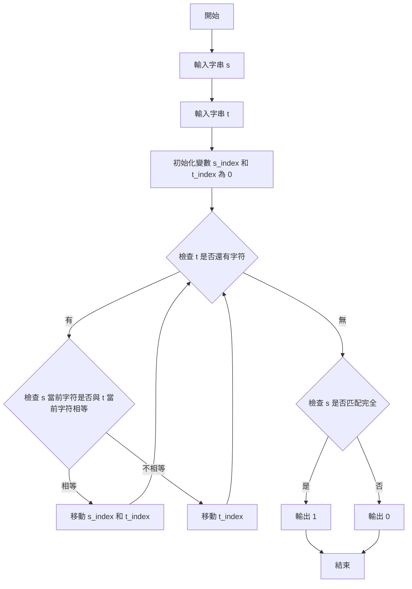

# Homework 3: 偵測subsequence
**4112052024 生科二 楊捷壬**

## 簡介及設計思維

接受兩個字串作為輸入，檢查第一個字串 `s` 是否為第二個字串 `t` 的子序列。  
若是子序列，輸出 `1`；否則，輸出 `0`。

## 流程圖

以下是程式執行流程的簡化示意圖：



## 程式概述

### 功能描述
使用者輸入兩個字串：
- 第一個字串 `s`：檢查是否為子序列的字串。
- 第二個字串 `t`：作為被檢查的字串。

程式將比較 `s` 和 `t` 的字符，並輸出 `1`（是子序列）或 `0`（不是子序列）。

### 資料結構及變數說明

#### 字串
1. **字符型陣列 `s[]` 與 `t[]`**  
   - 用來儲存用戶輸入的兩個字串。
   - `s[]` 是目標字串，`t[]` 是來源字串。

#### 整數變數
1. **`s_len` 與 `t_len`**  
   - 分別儲存字串 `s` 和 `t` 的長度。

2. **`s_index` 與 `t_index`**  
   - 分別用來遍歷字串 `s` 和 `t` 的索引值。

### 函式參數
1. **`const char *s` 與 `const char *t`**  
   - 分別指向用戶輸入的兩個字串。

---

## 程式說明

### 程式架構與主要函式

#### 檢查子序列 (`is_subsequence`)
此函式負責判斷字串 `s` 是否為字串 `t` 的子序列。透過兩個index遍歷 `s` 和 `t`，逐一匹配字符。

```c
int is_subsequence(const char *s, const char *t) {
    int s_len = (int)strlen(s);
    int t_len = (int)strlen(t);

    int s_index = 0;
    int t_index = 0;

    while (s_index < s_len && t_index < t_len) {
        if (s[s_index] == t[t_index]) {
            // 如果字符相同，那s的索引值加1
            s_index++;
        }
        // t 的索引值加1
        t_index++;
    }

    // 如果子's'字串全部可以在't'字串中匹配完成 then return 1
    return (s_index == s_len) ? 1 : 0;
}
```

#### 主程式 (`main`)
主程式負責：
- 接收兩個字串作為輸入。
- 使用 `is_subsequence` 函式判斷結果。
- 輸出 `1` 或 `0`。

```c
int main(void) {
    // 輸入字串=1000，再加上一個終止符\0
    char s[1001], t[1001];
    printf("plz enter first string:");
    scanf("%s", s);
    printf("plz enter second string:");
    scanf("%s", t);

    int result = is_subsequence(s, t);
    printf("%d\n", result);

    return 0;
}
```
