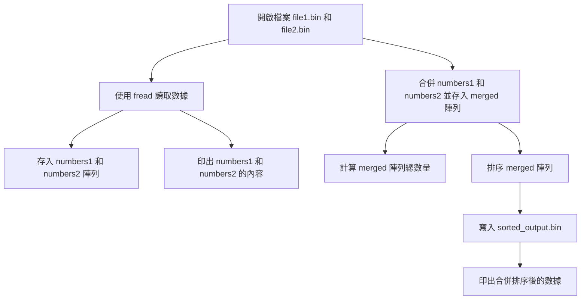

# Homework 5: Merging Binary Files and Sorting
**4112052024 生科二 楊捷壬**

## 流程圖

以下是程式執行流程的簡化示意圖：

## 程式概述
### 功能描述
1. 從兩個二進位檔案讀取數列。  
2. 將兩個數列合併並排序。  
3. 將排序後的數列寫入新的二進位檔案。 
### 資料結構及變數說明  
#### 數列 (Array)  
1. **整數型數列 `numbers1[]` 與 `numbers2[]`**  
   - 分別儲存從兩個二進位檔案讀取的數列。  
2. **整數型數列 `merged[]`**  
   - 儲存合併後的數列。  
3. **size_t變數 `size1` 與 `size2`**  
   - 分別儲存 `numbers1[]` 和 `numbers2[]` 的數列長度。  
4. **整數變數 `totalSize`**  
   - 儲存合併後數列的總長度。  

### 函式參數  
1. **`array`**  
   - 指向需要排序的數列。  
2. **`size`**  
   - 數列的長度，告訴排序函式要排序多少變數。 

---
## 程式說明  
### 排序函式 (sortArray)  
這個函式使用bubble＿sort將數列進行排序。  

```c
void sortArray(int *array, int size) {
    // 外層迴圈控制排序的輪數
    for (int i = 0; i < size - 1; i++) {
        // 內層迴圈進行相鄰元素的比較和交換
        for (int j = 0; j < size - i - 1; j++) {
            // 如果前一個元素大於後一個元素，則交換它們
            if (array[j] > array[j + 1]) {
                int temp = array[j]; // 暫存較大的元素
                array[j] = array[j + 1]; // 將較小的元素移到前面
                array[j + 1] = temp; // 將較大的元素移到後面
            }
        }
    }
}
```

## 主要函式
```c
int main(void) {
    const char *file1 = "/Users/ericyang/Github/C-course_assignment/Assignment5/file1.bin";
    const char *file2 = "/Users/ericyang/Github/C-course_assignment/Assignment5/file2.bin";
    const char *outputFile = "/Users/ericyang/Github/C-course_assignment/Assignment5/sorted_output.bin";

    int numbers1[MAX];
    int numbers2[MAX];
    int merged[MAX * 2];
    size_t size1, size2;
    int totalSize;

    // 讀取檔案內容到陣列
    FILE *readFile1 = fopen(file1, "rb");
    FILE *readFile2 = fopen(file2, "rb");
    size1 = fread(numbers1, sizeof(int), MAX, readFile1);
    size2 = fread(numbers2, sizeof(int), MAX, readFile2);
    
    // 印出數列1的內容
    for (int i = 0; i < size1; i++) {
        printf("%d ", numbers1[i]);
    }
    printf("\n");
    
    // 印出數列2的內容
    for (int i = 0; i < size2; i++) {
        printf("%d ", numbers2[i]);
    }
    printf("\n");

    // 關閉檔案
    fclose(readFile1);
    fclose(readFile2);

    // 合併兩個數列
    for (int i = 0; i < size1; i++) {
        merged[i] = numbers1[i];
    }
    for (int i = 0; i < size2; i++) {
        merged[size1 + i] = numbers2[i];
    }
    totalSize = (int)size1 + (int)size2;

    // 對合併後的數列進行排序
    sortArray(merged, totalSize);

    // 將排序後的陣列寫入輸出檔案
    FILE *writeFile = fopen(outputFile, "wb");
    if (writeFile == NULL) {
        perror("Error creating sorted_output.bin");
        return EXIT_FAILURE;
    }

    fwrite(merged, sizeof(int), totalSize, writeFile);
    fclose(writeFile);

    printf("Merged and sorted integers written to %s\n", outputFile);
    
    // 印出排序後的數列
    for (int i = 0; i < totalSize; i++) {
        printf("%d ", merged[i]);
    }
    printf("\n");

    return EXIT_SUCCESS;
}
```
## 問題及暫時解決方式
當我使用 Mac 的 Xcode 軟體時，發生讀取不到檔案的問題，嘗試了多種相對路徑的想法，但不知為何就是讀取不到檔案，所以後來只能使用絕對路徑。